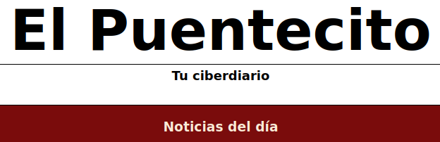

# EjercicioNoticiasCSS

**El Puentecito** es una página web sencilla de noticias, creada como un ejercicio inicial para aprender HTML y CSS. La página presenta un conjunto de noticias curiosas y entretenidas, organizadas en diferentes secciones, con un diseño básico pero funcional.

## Estructura del Proyecto

El proyecto se compone de un único archivo HTML y una hoja de estilos CSS:

- `index.html`: Contiene la estructura y el contenido principal de la página web.
- `style.css`: Define el estilo y la apariencia de la página.

## Contenido

La página web incluye las siguientes secciones:

1. **Header**
   - Título principal: "El Puentecito"
   - Subtítulo: "Tu ciberdiario"

2. **Main**
   - **Aside**: Lista de noticias del día.
   - **Sections**: Cada sección presenta una noticia específica, con un título, subtítulo y artículo detallado. Las noticias incluyen imágenes relacionadas.

## Instalación y Uso

Clona el repositorio a tu máquina local:
"git clone https://github.com/AdrianTerciado/EjercicioNoticiasCSS.git"

Navega al directorio del proyecto:
cd "nombre de la carpeta"

Abre el archivo index.html en tu navegador preferido para ver la página web.

## Contribuciones

Este proyecto fue realizado como una práctica inicial de HTML y CSS. Si deseas contribuir, siéntete libre de hacer un fork del proyecto y enviar pull requests con mejoras o nuevas características.

## Autor
Creado por: Adrián Terciado Fernández.